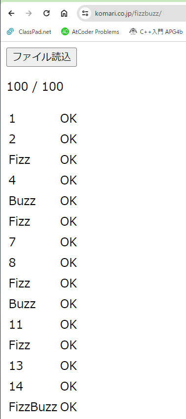

# Fizz-Buzz
### Fizz Buzzの定義

```
i(in [1, 100])行目が
3の倍数なら"Fizz"
5の倍数なら"Buzz"
15の倍数なら"FizzBuzz"
どれでもなければ"i"
```
https://ja.wikipedia.org/wiki/Fizz_Buzz

### Rules
- AtCoderのコードテストにある全言語でFizzBuzzの問題を解く
- 「🔍OO言語　FizzBuzz」の検索はしない


### Fizz Buzz Checker


https://komari.co.jp/fizzbuzz/
で100/100にする

## 1.><>
fish
```fish
```

## 2.AWK
```AWK
BEGIN {
    for (i=1; i<=100; ++i) {
      s = ""
      if (i % 15 == 0) s = "FizzBuzz";
      else if (i % 3 == 0) s = "Fizz";
      else if (i % 5 == 0)  s = "Buzz";
      else s = i;
      print s;
    }
}
```

## 3.Ada
```Ada
with Ada.Text_IO, Ada.Integer_Text_IO, Ada.Float_Text_IO;
use Ada.Text_IO;

procedure Program is
   I : Integer := 1;
   F : String := "FizzBuzz";
begin
   for I in 1 .. 100 loop
      if I mod 15 = 0 then
        Put_Line(F(1..8));
      elsif I mod 3 = 0 then
        Put_Line(F(1..4));
      elsif I mod 5 = 0 then
        Put_Line(F(5..8));
      else
        Put_Line(Integer'Image(I));
      end if;
   end loop;
end Program;
```

## 4.Assembly x64
```Assembly
```

## 5.Bash
```Bash
for ((i=1; i <= 100; i++)); do
    if (($i % 15 == 0)); then
        echo "FizzBuzz"
    elif (($i % 3 == 0)); then
        echo "Fizz"
    elif (($i % 5 == 0)); then
        echo "Buzz"
    else
        echo $i
    fi
done
```

## 6.Brainfuck
```Brainfuck
++++++++++[->>>>++++++++++>+++++++>+++++++>++++++++++>++++++++++++>++++++++++++<
<<<<<<<<]>>>>+>---->>+++++>--->++<<<<<<<<<+++++[->>>>>>>>>>+>+>++>+++<<<<<<<<<<<
<<]>>>>>>>>>>--<<<<<<[-<+>>>>>>>>>>>>>>+<<<<<<<<<<<<<]<[->+<]>>>>>>>>>>[->>+>>>>
>>>>>>+<<<<<<<<<<<<]>>[-<<+>>]<<<<<[->>>>>+>>>>>>>>>>>>>>>>>>+<<<<<<<<<<<<<<<<<<
<<<<<]>>>>>[-<<<<<+>>>>>]<<<<[->>>>+>>>>>>>>>>>>>>>>>>>>>>>>>>+<<<<<<<<<<<<<<<<<
<<<<<<<<<<<<<]>>>>[-<<<<+>>>>]<<<[->>>+>>>>>>>>>>>>>>>>>>>>>>>>>>>>>>>>>>>>>>>>>
>+<<<<<<<<<<<<<<<<<<<<<<<<<<<<<<<<<<<<<<<<<<<<<]>>>[-<<<+>>>]>+[>[->+<<<+>>]<<[-
>>+<<]>[->>>+<<<<+>]<[->+<]>>>[->>+<<]>[->-<]>>+<[[-]>-<]>>+<[[-]>-<<<<<<[-]>>>>
>]>[-<<<<<<[->>>>>>>+>+<<<<<<<<]>>>>>>>[-<<<<<<<+>>>>>>>]>>[-<<+>>>+<]<<[->>+<<]
>[->>->[-]>[-]>[-]<<<[->+>+<<]>>[-<<+>>]<[[-]>+<]>>+<[[-]>-<]>[-<<<<[->+>+<<]>>[
-<<+>>]>>]<<<<<]>[->>+>+<<<]>>>[-<<<+>>>]<[-<->]+<[[-]>-<]>[->>>>>>>>>>>>>>>>>>>
>>+<<<<<<<<<<<<<<<<<<<<<]<<<<<<<<<<<[-<+>>>>>>>>>>>>>>>>>+<<<<<<<<<<<<<<<<]<[->+
<]>>>>>>>>>>>>>>>>>>[->+<<<+>>]<<[->>+<<]>[->>->[-]>[-]>[-]<<<[->+>+<<]>>[-<<+>>
]<[[-]>+<]>>+<[[-]>-<]>[-<<<<[->+>+<<]>>[-<<+>>]>>]<<<<<]>[->>+>+<<<]>>>[-<<<+>>
>]<[-<->]+<[[-]>-<]>[->>>>>>>>>>>>>>+<<<<<<<<<<<<<<]<<<<<<<<<<<<<<<<<<<[-<+>>>>>
>>>>>>>>>>>>>>>>>>>>+<<<<<<<<<<<<<<<<<<<<<<<<]<[->+<]>>>>>>>>>>>>>>>>>>>>>>>>>>[
->+<<<+>>]<<[->>+<<]>[->>->[-]>[-]>[-]<<<[->+>+<<]>>[-<<+>>]<[[-]>+<]>>+<[[-]>-<
]>[-<<<<[->+>+<<]>>[-<<+>>]>>]<<<<<]>[->>+>+<<<]>>>[-<<<+>>>]<[-<->]+<[[-]>-<]>[
->>>>>>>+<<<<<<<]>>>>>>>>+<<<[->[-]>[-]>[-]<<<<<<<<<<<<<<<<<<<<<<<<<<<<<<<<<<<<<
<<<<<<<<.>.>>..<<<<.>>>.>..>>>.>>>>>>>>>>>>>>>>>>>>>>>>>>>>>>>>>>>>]>[->[-]>[-]<
<<<<<<<<<<<<<<<<<<<<<<<<<<<<<<<<<<<<<<<<<<<<.>.>>..>>>.>>>>>>>>>>>>>>>>>>>>>>>>>
>>>>>>>>>>>>]>[->[-]<<<<<<<<<<<<<<<<<<<<<<<<<<<<<<<<<<<<<<<<<<<<<<.>>>.>..>>>.>>
>>>>>>>>>>>>>>>>>>>>>>>>>>>>>>>>>>>>]>[-<<<<<<<<<<<<<<<<<<<<<<<<<<<<<<<<<<<[-<+>
>>>>>>>>>>>>>>>>>>>>>>>>>>>>>>>>>>>>>>>>+<<<<<<<<<<<<<<<<<<<<<<<<<<<<<<<<<<<<<<<
<]<[->+<]>>>>>>>>>>>>>>>>>>>>>>>>>>>>>>>>>>>>>>>>>>[->+<<<+>>]<<[->>+<<]>[->>->[
-]>[-]>[-]<<<[->+>+<<]>>[-<<+>>]<[[-]>+<]>>+<[[-]>-<]>[-<<<<[->+>+<<]>>[-<<+>>]>
>>+<]<<<<<]>>>>>>>++++++++++<<<<<[->>>>>-<<<<<]>>>>[->>+>+<<<]>>>[-<<<+>>>]<[[-]
>+<]>>>++++++++[-<++++++>]<[-<<<+<+>>>>]<[-<<<.>>>]<<<[-]>.[-]++++++++++.[-]<<<<
<<<<<<<<]<<<<<<<<<<<<<<<<<<<<<<<<<<<<<<<<<<<+>>>>>>]<<<<<<]
```

## 7.C
```C
#include <stdio.h>
#include <string.h>
int main() {
    for (int i=1; i<=100; ++i) {
        if (i % 3 == 0) printf("Fizz");
        if (i % 5 == 0) printf("Buzz");
        if (i % 3 != 0 && i % 5 != 0) printf("%d", i);
        printf("\n");
    }
}
```

## 8.C#
```C#
using System;

class Program {
    static void Main() {
        int N, K;
        string input = Console.ReadLine();
        N = int.Parse(input.Split(' ')[0]);
        for (int i = 1; i <= N; i++) {
            string output = "";
            if (i % 3 == 0) output += "Fizz";
            if (i % 5 == 0) output += "Buzz";
            if (output == "") output = i.ToString();
            Console.WriteLine(output);
        }
        K = int.Parse(input.Split(' ')[1]);
        Console.WriteLine(K);
    }
}
```

## 9.C++
```C++
#include <iostream>
#include <string>
using namespace std;
int main() {
    for (int i=1; i<=100; ++i) {
        string s = "";
        if (i % 3 == 0) s += "Fizz";
        if (i % 5 == 0) s += "Buzz";
        if (s == "") s += to_string(i);
        cout << s << endl;
    }
}
```

## 10.COBOL
```COBOL
       IDENTIFICATION DIVISION.
       PROGRAM-ID. MAIN.
       ENVIRONMENT DIVISION.
       CONFIGURATION SECTION.
       DATA DIVISION.
       WORKING-STORAGE SECTION.
       01 WORK-AREA.
       03 disp PIC Z(3).
       03 I PIC 999.
       PROCEDURE DIVISION.
           PERFORM VARYING I FROM 1 BY 1 UNTIL I > 100
               IF FUNCTION MOD(I, 15) = 0
                   DISPLAY "FizzBuzz"
               ELSE IF FUNCTION MOD(I, 3) = 0
                   DISPLAY "Fizz"
               ELSE IF FUNCTION MOD(I, 5) = 0
                   DISPLAY "Buzz"
               ELSE
                   COMPUTE disp = I
                   DISPLAY disp
               END-IF
           END-PERFORM.
           STOP RUN.
       END PROGRAM MAIN.
```

## 11.Carp
```Carp
(use IO)
(use String)
(use Int)

(defn fizzbuzz [i n]
  (if (< i (+ n 1))
    (do
      (if (= 0 (mod i 15))
        (println* "FizzBuzz")
        (do
          (if (= 0 (mod i 3))
            (println* "Fizz")
            (do
              (if (= 0 (mod i 5))
                (println* "Buzz")
                (println &(Int.str i))
              )
            )
          )
        )
      )
      (fizzbuzz (inc i) n)
    )
    ()
  )
)

(defn main []
  (fizzbuzz 1 100)
)
```

## 12.Clojure
```Clojure
(loop [i 1]
    (cond
        (zero? (mod i 15)) (println "FizzBuzz")
        (zero? (mod i 3)) (println "Fizz")
        (zero? (mod i 5)) (println "Buzz")
        :else (println i))
    (if (< i 101)
        (recur (inc i))
        i))
```

## 13.Common Lisp
```Lisp
(defun fizzbuzz (n)
    (when (< n 101)
        (cond
            ((= 0 (mod n 15))
                (write-string "FizzBuzz")
            )
            ((= 0 (mod n 3))
                (write-string "Fizz")
            )
            ((= 0 (mod n 5))
                (write-string "Buzz")
            )
            (t
                (write-string (write-to-string n))
            )
        )
        (terpri)
        (fizzbuzz (+ 1 n))
    )
)
(fizzbuzz 1)
```

## 14.Crystal
```Crystal
n = (1).to_i
while n <= 100
    if n % 15 == 0
        puts "FizzBuzz"
    elsif n % 3 == 0
        puts "Fizz"
    elsif n % 5 == 0
        puts "Buzz"
    else
        puts n
    end
    n += 1
end
```

## 15.x
```x
```

## 16.x
```x
```

## 17.x
```x
```

## 18.x
```x
```

## 19.x
```x
```

## 20.x
```x
```

## 21.x
```x
```

## 22.x
```x
```

## 23.x
```x
```

## 24.x
```x
```

## 25.x
```x
```

## 26.x
```x
```

## 27.x
```x
```

## 28.x
```x
```

## 29.x
```x
```

## 30.x
```x
```

## 31.x
```x
```

## 32.Kotlin
```kt
fun main() {
    for (i in 1..100) {
        if (i % 3 == 0) print("Fizz")
        if (i % 5 == 0) print("Buzz")
        if (i % 3 != 0 && i % 5 != 0) print("$i")
        println("")
    }
}
```

## 33.x
```x
```

## 34.x
```x
```

## 35.x
```x
```

## 36.x
```x
```

## 37.x
```x
```

## 38.x
```x
```

## 39.x
```x
```

## 40.x
```x
```

## 41.x
```x
```

## 42.x
```x
```

## 43.x
```x
```

## 44.x
```x
```

## 45.x
```x
```

## 46.x
```x
```

## 47.x
```x
```

## 48.x
```x
```

## 49.x
```x
```

## 50.x
```x
```

## 51.x
```x
```

## 52.x
```x
```

## 53.x
```x
```

## 54.x
```x
```

## 55.x
```x
```

## 56.x
```x
```

## 57.x
```x
```

## 58.x
```x
```

## 59.x
```x
```

## 60.x
```x
```

## 61.x
```x
```

## 62.x
```x
```

## 63.x
```x
```

## 64.x
```x
```

## 65.x
```x
```

## 66.x
```x
```

## 67.x
```x
```

## 68.x
```x
```

## 69.x
```x
```

## 70.x
```x
```

